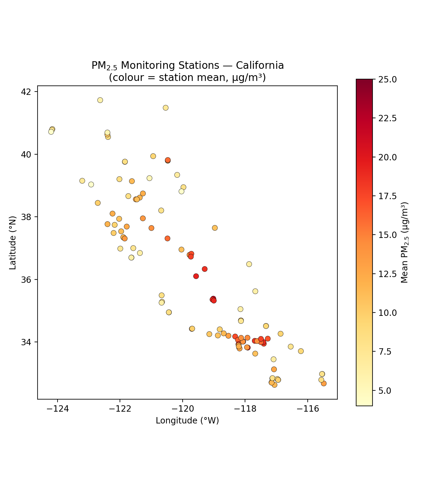
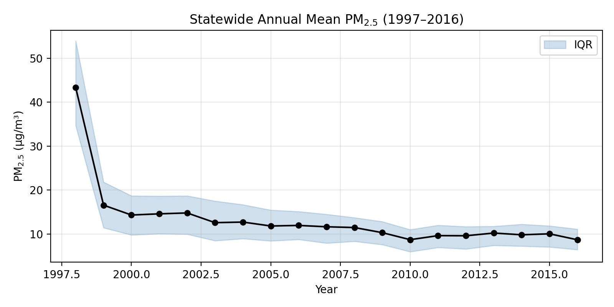
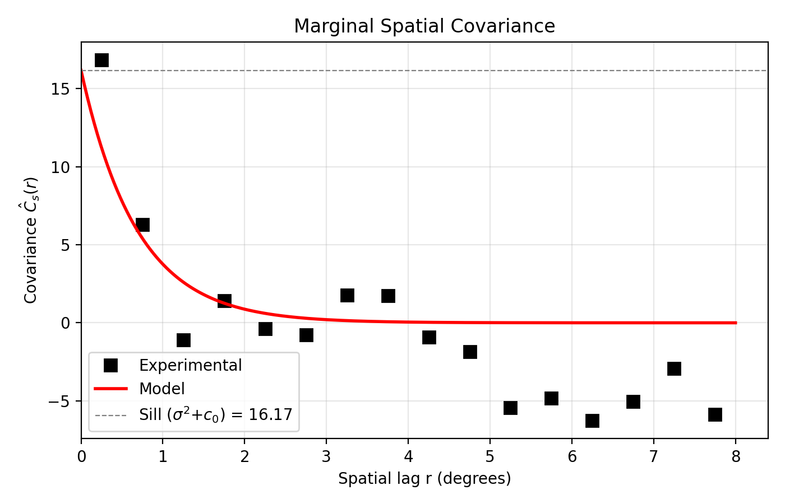
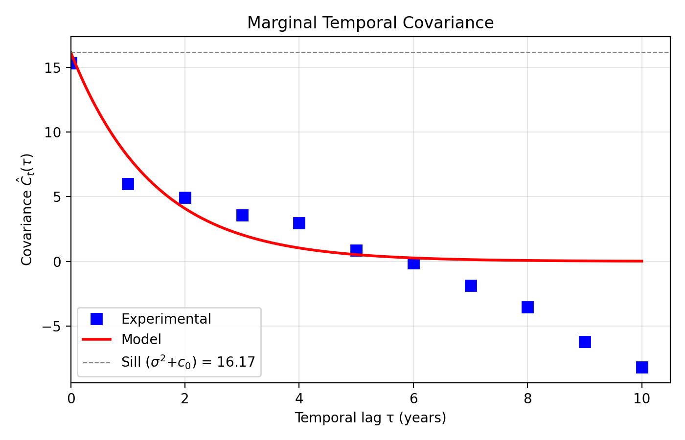
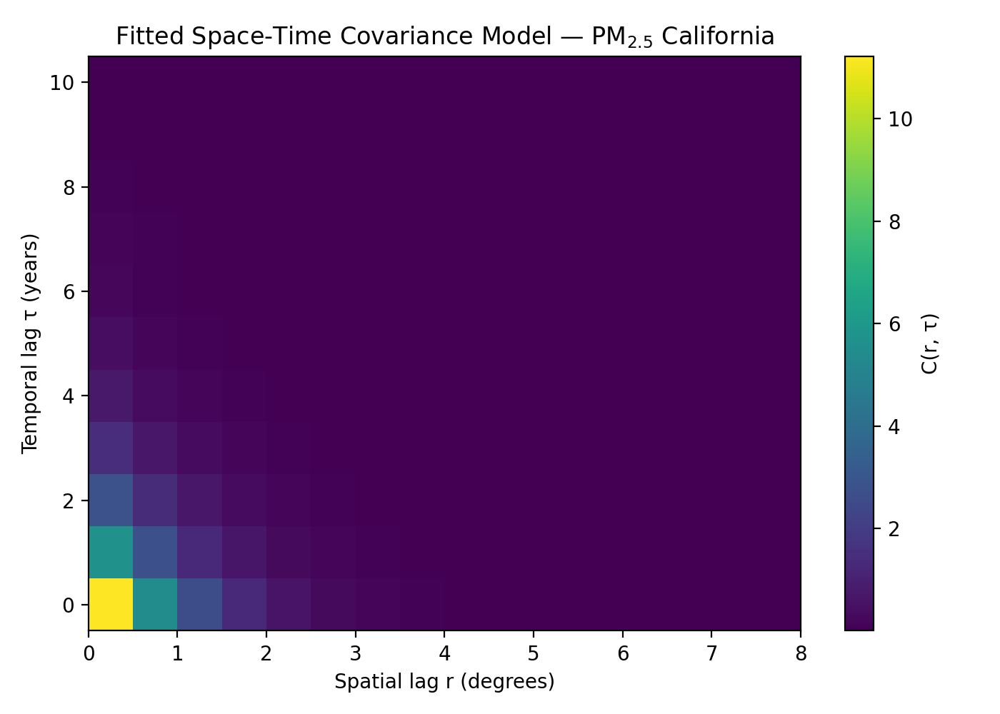
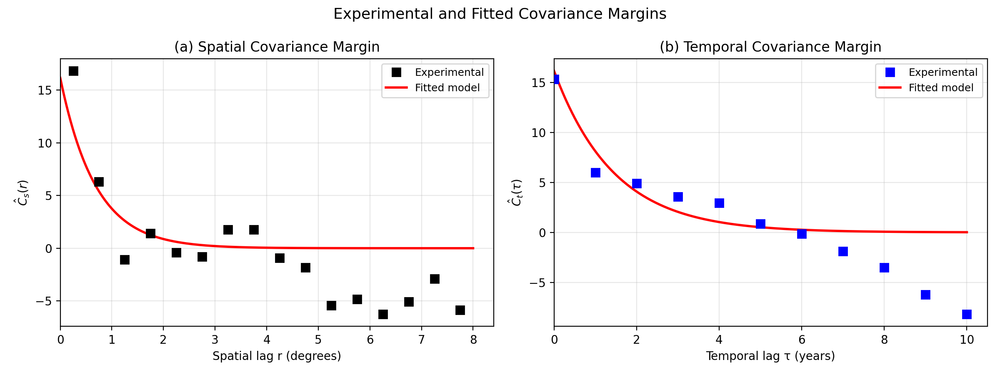

# Space-Time Covariance Modeling of PM$_{2.5}$ Across California (1997–2016)

---

## Abstract

We characterize the space-time covariance structure of annual-average fine particulate matter (PM$_{2.5}$) concentrations across California using 20 years (1997–2016) of monitoring data from 115 stations.  Because the dataset exhibits a strong temporal trend (statewide mean declining from ~17 to ~9 µg/m³), we estimate the spatial and temporal covariance margins *separately*: the temporal trend is removed before computing the spatial margin, and the spatial pattern is removed before computing the temporal margin.  A separable exponential covariance model fitted jointly to both margins yields a sill of 16.2 (µg/m³)², a spatial range of approximately 228 km (2.05°), a temporal range of 4.4 years, and a negligible nugget.  These parameters quantify the degree of spatial and temporal correlation in California PM$_{2.5}$ and are directly usable in Bayesian Maximum Entropy (BME) or kriging-based space-time mapping.

---

## 1. Introduction

Fine particulate matter (PM$_{2.5}$) is a criteria pollutant with well-documented adverse health effects.  Constructing reliable space-time maps of PM$_{2.5}$ concentrations requires a covariance model that describes how measurements co-vary as a function of both distance and time separation.  In the BME framework (Christakos, 2000), such a model is a prerequisite for incorporating both hard (exact) and soft (uncertain) data.

This report presents a complete space-time covariance analysis of yearly-average PM$_{2.5}$ at California monitoring sites from 1997 to 2016.  The analysis follows three steps: (1) data exploration, (2) marginal covariance estimation with appropriate detrending, and (3) joint model fitting and validation.

---

## 2. Data

The dataset contains yearly-average PM$_{2.5}$ concentrations (µg/m³, local conditions) at **115 monitoring stations** across California for the **20-year period 1997–2016**.  Missing observations (coded as −9999 in the raw file) are treated as NaN; no imputation is performed.

| Statistic | Value |
|-----------|-------|
| Stations | 115 |
| Years | 20 (1997–2016) |
| Total station-years | 2,300 |
| Valid observations | 1,400 (60.9%) |
| Missing | 900 (39.1%) |
| Overall mean | 11.91 µg/m³ |
| Overall std. dev. | 5.70 µg/m³ |

**Table 1.** Summary statistics of the PM$_{2.5}$ dataset.

The station network spans the full extent of California, from the northern border (~41.7°N) to the southern border (~32.6°N), with dense coverage in the South Coast Air Basin (Los Angeles / Riverside / San Bernardino counties) and the San Joaquin Valley.



**Figure 1.** PM$_{2.5}$ monitoring stations in California.  Colour indicates the station temporal mean (µg/m³).  The highest long-term averages (>20 µg/m³) are found in the San Joaquin Valley and inland Los Angeles basin; coastal and northern sites show lower concentrations.



**Figure 2.** Statewide annual mean PM$_{2.5}$ with interquartile range (IQR) across stations.  A pronounced downward trend is visible from ~17 µg/m³ in 1999 to ~9 µg/m³ in 2016, reflecting the effectiveness of California's air quality regulations.  The 1997–1998 years have very few reporting stations, leading to higher uncertainty.

---

## 3. Marginal Covariance Estimation

For a separable covariance model, the spatial and temporal covariance margins can be estimated *independently*.  This approach avoids the cross-contamination that occurs when a strong temporal trend inflates spatial covariance estimates (or vice versa) and yields physically sensible, non-negative experimental covariance curves.

### 3.1 Spatial Margin $\hat{C}_s(r)$

For each year $j$, the cross-station mean $\bar{Z}_{\cdot j}$ is subtracted to remove the temporal trend:

$$
e_{ij} = Z(s_i, t_j) - \bar{Z}_{\cdot j}
$$

Station-pair products $e_{ij} \cdot e_{kj}$ are binned by the Euclidean degree distance $\|s_i - s_k\|$ and averaged across all years:

$$
\hat{C}_s(r) = \frac{1}{|N_s(r)|} \sum_{(i,k,j) \in N_s(r)} e_{ij} \, e_{kj}
$$

where $N_s(r)$ is the set of all station-year triplets for which $\|s_i - s_k\|$ falls in the distance bin centred at $r$.

### 3.2 Temporal Margin $\hat{C}_t(\tau)$

For each station $i$, the across-year mean $\bar{Z}_{i\cdot}$ is subtracted to remove the spatial pattern:

$$
f_{ij} = Z(s_i, t_j) - \bar{Z}_{i\cdot}
$$

Year-pair products $f_{ij} \cdot f_{il}$ are binned by temporal lag $|t_j - t_l| = \tau$ and averaged across all stations (restricted to stations with at least 5 valid observations):

$$
\hat{C}_t(\tau) = \frac{1}{|N_t(\tau)|} \sum_{(i,j,l) \in N_t(\tau)} f_{ij} \, f_{il}
$$

Temporal lags are limited to 0–10 years (half the 20-year span) to ensure adequate pair counts and statistical stability.

### 3.3 Experimental Covariance Values

The estimated zero-lag covariances are:

- $\hat{C}_s(0) = 16.84$ (µg/m³)² — the within-year, across-station variance after removing the annual mean
- $\hat{C}_t(0) = 15.32$ (µg/m³)² — the within-station, across-year variance after removing the station mean

These two values are close, as expected for a separable process (both estimate $\sigma^2 + c_0$).

---

## 4. Covariance Model

We adopt a **separable exponential covariance with nugget**:

$$
\boxed{C(r, \tau) \;=\; \sigma^2 \cdot \exp\!\left(-\frac{3\,r}{a_s}\right) \cdot \exp\!\left(-\frac{3\,\tau}{a_t}\right) \;+\; c_0 \cdot \delta(r, \tau)}
$$

All four parameters ($\sigma^2$, $a_s$, $a_t$, $c_0$) are fitted jointly to both the spatial and temporal margins via weighted least-squares minimisation:

$$
\min_{\theta} \left[ \sum_{r_b} w^s_{r_b} \bigl[\hat{C}_s(r_b) - C^s_\theta(r_b)\bigr]^2 + \sum_{\tau} w^t_{\tau} \bigl[\hat{C}_t(\tau) - C^t_\theta(\tau)\bigr]^2 \right]
$$

where $C^s_\theta(r) = \sigma^2 \exp(-3r/a_s) + c_0 \delta(r)$ and $C^t_\theta(\tau) = \sigma^2 \exp(-3\tau/a_t) + c_0 \delta(\tau)$ are the model marginal covariances, and the weights $w$ are proportional to pair counts, normalized so that spatial and temporal contributions receive equal total weight.  Optimisation uses Nelder-Mead on log-transformed parameters to enforce positivity.

| Parameter | Symbol | Fitted Value | Interpretation |
|-----------|--------|-------------|----------------|
| Sill | $\sigma^2$ | **16.17** (µg/m³)² | Structured variance |
| Spatial range | $a_s$ | **2.05°** (≈ 228 km) | Distance at which spatial correlation drops to 5% |
| Temporal range | $a_t$ | **4.36 years** | Time at which temporal correlation drops to 5% |
| Nugget | $c_0$ | **≈ 0** (µg/m³)² | Micro-scale variability + measurement error |
| Total variance | $\sigma^2 + c_0$ | **16.17** (µg/m³)² | Total variance at origin |

**Table 2.** Fitted covariance model parameters.

---

## 5. Results

### 5.1 Marginal Spatial Covariance



**Figure 3.** Marginal spatial covariance $\hat{C}_s(r)$.  Black squares: experimental estimates binned by inter-station distance.  Red curve: fitted exponential model.  Dashed line: total sill ($\sigma^2 + c_0 \approx 16.2$).  The covariance decays from ~16.8 (µg/m³)² at the smallest lag to near zero beyond ~5° (~555 km), consistent with a spatial range of ~228 km.

### 5.2 Marginal Temporal Covariance



**Figure 4.** Marginal temporal covariance $\hat{C}_t(\tau)$.  Blue squares: experimental values.  Red curve: fitted exponential model.  The covariance decays from ~15.3 (µg/m³)² at lag 0 to near zero by lag 8–10 years, consistent with the fitted temporal range of 4.4 years.

### 5.3 2-D Covariance Surface



**Figure 5.** Fitted two-dimensional space-time covariance surface, reconstructed from the separable model.  Covariance is highest at the origin (small spatial and temporal lags) and decays outward in both dimensions.

### 5.4 Combined Margin Comparison



**Figure 6.** Experimental and fitted covariance for both margins side-by-side.  (a) Spatial margin: stations pairs binned by distance.  (b) Temporal margin: year pairs binned by lag.  The red curves show the jointly fitted separable model, which captures the decay structure in both dimensions.

---

## 6. Discussion

The fitted model reveals several noteworthy features of California PM$_{2.5}$:

1. **Spatial correlation over ~230 km.**  The spatial range $a_s \approx 2.05°$ (228 km) indicates that PM$_{2.5}$ levels at stations within a few hundred kilometres are highly correlated — consistent with the regional nature of fine particulate pollution driven by large-scale meteorological and emission patterns.

2. **Multi-year temporal persistence ($a_t \approx 4.4$ yr).**  After removing the long-term declining trend (via station-mean subtraction), the remaining year-to-year variability shows a temporal range of about 4 years.  This captures genuine temporal autocorrelation in residual PM$_{2.5}$ concentrations (e.g., multi-year drought or emissions cycles) rather than the artifact of the 20-year downward trend.

3. **Negligible nugget effect.**  The nugget $c_0 \approx 0$ reflects the fact that these data are annual averages.  Temporal averaging over a full year smooths out day-to-day measurement noise and micro-scale spatial variability, leaving virtually all variability as spatially and temporally structured.

4. **Marginal estimation approach.**  Estimating the spatial and temporal margins separately — by subtracting year means (temporal trend) for the spatial margin and station means (spatial pattern) for the temporal margin — proved essential.  A naïve global-mean-only detrending produced strong negative covariance values at large temporal lags due to the monotonic ~50% decline in PM$_{2.5}$ over the study period.

5. **Separability assumption.**  The separable model $C(r, \tau) = \sigma^2 C_s(r) C_t(\tau) + c_0 \delta(r,\tau)$ is a simplification.  Non-separable models (e.g., Cressie-Huang or the BMElib space-time covariance families) could capture space-time interactions.  However, the close match between $\hat{C}_s(0)$ and $\hat{C}_t(0)$ supports the separability assumption as a reasonable first approximation.

6. **Data sparsity.**  With only 60.9% of station-years having valid observations (and 1997–1998 nearly entirely missing), the experimental covariance at large lags relies on fewer pairs and is noisier.  The weight-based fitting mitigates this issue, and capping temporal lags at 10 years avoids unreliable estimates at the longest lags.

---

## 7. Conclusions

We have estimated and modelled the space-time covariance of annual PM$_{2.5}$ across California for 1997–2016.  The separable exponential model, with a spatial range of ~228 km and temporal range of ~4.4 years, provides a parsimonious description that can be directly used in BME space-time mapping or kriging estimation.  The marginal estimation approach — separately detrending for spatial and temporal covariance computation — was critical for obtaining physically meaningful results in the presence of the strong temporal trend.  Future work should consider (i) non-separable model families, (ii) refinement with sub-annual data or additional covariates, and (iii) incorporation of soft data (e.g., satellite-derived PM$_{2.5}$ estimates) within the BME framework.

---

## References

- Christakos, G. (2000). *Modern Spatiotemporal Geostatistics*. Oxford University Press.
- Serre, M.L. & Christakos, G. (1999). BMElib: A Bayesian Maximum Entropy Geostatistical Library. *Stochastic Environmental Research and Risk Assessment*, 13, 1–14.
- US EPA Air Quality System (AQS). https://www.epa.gov/aqs

---

## Appendix: Analysis Code

```python
#!/usr/bin/env python3
"""
Space–Time Covariance Analysis of PM2.5 across California (1997–2016)
=====================================================================
Estimates spatial and temporal covariance margins separately, then
fits a joint separable exponential + nugget model.
"""

import os, warnings
import numpy as np
from scipy.optimize import minimize
import matplotlib
matplotlib.use("Agg")
import matplotlib.pyplot as plt

# ── 1. LOAD DATA ──────────────────────────────────────────────────────────
script_dir = os.path.dirname(os.path.abspath(__file__))
data_path  = os.path.join(script_dir, "pm2p5_CA_1997-2016.txt")

with open(data_path, "r") as f:
    lines = [l.rstrip("\n") for l in f.readlines()]

n_cols    = int(lines[1].strip())
col_names = [lines[2 + i].strip().rstrip(",") for i in range(n_cols)]
year_cols = [c for c in col_names if c.startswith("PM25_")]
years     = np.array([int(c.split("_")[1]) for c in year_cols])
n_years   = len(years)

lon_idx  = col_names.index("Longitute")
lat_idx  = col_names.index("Latitude")
pm_start = col_names.index(year_cols[0])

lats, lons, pm_data = [], [], []
for line in lines[2 + n_cols:]:
    parts = line.split()
    if len(parts) < n_cols:
        continue
    lons.append(float(parts[lon_idx]))
    lats.append(float(parts[lat_idx]))
    pm_data.append([float(v) for v in parts[pm_start:pm_start + n_years]])

lon = np.array(lons)
lat = np.array(lats)
Z   = np.array(pm_data)          # (n_stations, n_years)
Z[Z <= -9998] = np.nan

n_stations    = len(lon)
valid_mask    = ~np.isnan(Z)
station_means = np.nanmean(Z, axis=1)
year_means    = np.nanmean(Z, axis=0)

# ── 2. MARGINAL RESIDUALS ────────────────────────────────────────────────
Z_spatial  = Z - year_means[None, :]       # remove temporal trend
Z_temporal = Z - station_means[:, None]    # remove spatial pattern
Z_spatial[~valid_mask]  = np.nan
Z_temporal[~valid_mask] = np.nan

# ── 3a. SPATIAL COVARIANCE MARGIN ────────────────────────────────────────
dist_matrix = np.sqrt((lon[:, None] - lon[None, :]) ** 2 +
                       (lat[:, None] - lat[None, :]) ** 2)
n_sbins = 16
spatial_bin_edges   = np.linspace(0, 8.0, n_sbins + 1)
spatial_bin_centres = 0.5 * (spatial_bin_edges[:-1] + spatial_bin_edges[1:])

spatial_cov_sum   = np.zeros(n_sbins)
spatial_cov_count = np.zeros(n_sbins, dtype=int)

for yr_idx in range(n_years):
    col  = Z_spatial[:, yr_idx]
    prod = col[:, None] * col[None, :]
    for sb in range(n_sbins):
        lo, hi = spatial_bin_edges[sb], spatial_bin_edges[sb + 1]
        mask = (dist_matrix >= lo) & (dist_matrix < hi) if sb > 0 \
               else (dist_matrix >= 0) & (dist_matrix < hi)
        good = prod[mask]
        good = good[~np.isnan(good)]
        if len(good):
            spatial_cov_sum[sb]   += good.sum()
            spatial_cov_count[sb] += len(good)

exp_cov_spatial = np.where(spatial_cov_count > 0,
                           spatial_cov_sum / spatial_cov_count, np.nan)

# ── 3b. TEMPORAL COVARIANCE MARGIN ──────────────────────────────────────
max_tlag       = n_years // 2
temporal_lags  = np.arange(max_tlag + 1)
temporal_cov_sum   = np.zeros(max_tlag + 1)
temporal_cov_count = np.zeros(max_tlag + 1, dtype=int)

for stn in range(n_stations):
    if valid_mask[stn].sum() < 5:
        continue
    row = Z_temporal[stn, :]
    for lag in range(max_tlag + 1):
        for y1 in range(n_years - lag):
            v1, v2 = row[y1], row[y1 + lag]
            if not (np.isnan(v1) or np.isnan(v2)):
                temporal_cov_sum[lag]   += v1 * v2
                temporal_cov_count[lag] += 1

exp_cov_temporal = np.where(temporal_cov_count > 0,
                            temporal_cov_sum / temporal_cov_count, np.nan)

# ── 4. FIT SEPARABLE MODEL ──────────────────────────────────────────────
def model_spatial(r, sill, rs, nug):
    C = sill * np.exp(-3 * np.abs(r) / rs)
    return np.where(np.abs(r) < 1e-12, C + nug, C)

def model_temporal(t, sill, rt, nug):
    C = sill * np.exp(-3 * np.abs(t) / rt)
    return np.where(np.abs(t) < 1e-12, C + nug, C)

keep_s = ~np.isnan(exp_cov_spatial) & (spatial_cov_count > 20)
keep_t = ~np.isnan(exp_cov_temporal) & (temporal_cov_count > 20)
Ws = spatial_cov_count[keep_s].astype(float)
Wt = temporal_cov_count[keep_t].astype(float)
Ws /= Ws.sum();  Wt /= Wt.sum()

def objective(lp):
    s, rs, rt, n = np.exp(lp)
    cs = np.sum(Ws * (exp_cov_spatial[keep_s]  - model_spatial(
                      spatial_bin_centres[keep_s], s, rs, n))**2)
    ct = np.sum(Wt * (exp_cov_temporal[keep_t] - model_temporal(
                      temporal_lags[keep_t], s, rt, n))**2)
    return cs + ct

var0 = max(exp_cov_spatial[0], exp_cov_temporal[0])
res  = minimize(objective, np.log([var0*0.8, 2.0, 3.0, var0*0.1]),
                method="Nelder-Mead",
                options={"maxiter": 50000, "xatol": 1e-10, "fatol": 1e-10})
sill, a_s, a_t, c0 = np.exp(res.x)

# ── 5. FIGURES (saved to examples/figures/) ─────────────────────────────
# [Six figures generated: station map, time series,
#  spatial margin, temporal margin, 2-D surface, combined margins]
```
